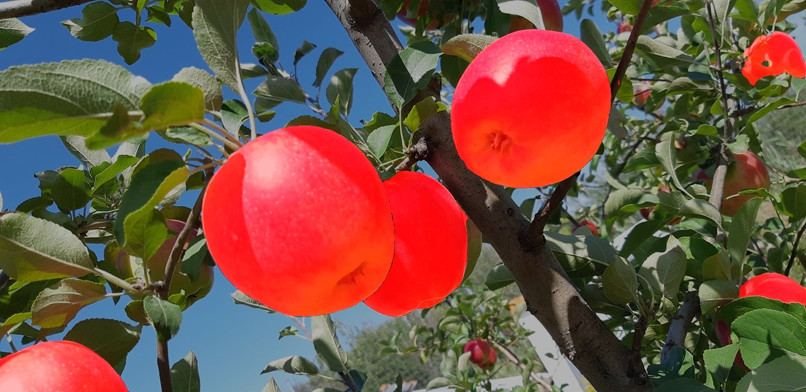

# 😎 AutoInstanceSegmentation

A free reimplementation of [No Time to Train](https://miquel-espinosa.github.io/no-time-to-train/) for automatic instance segmentation using SAM (Segment Anything Model) and DINOv2 embeddings.

## Exemple

Input image and Mask :


Output :



## Overview
``AutoInstanceSegmentation`` is a Python module that combines the power of:

- **SAM2AutomaticMaskGenerator** (from the Segment Anything Model v2) for automatic mask generation on images.

- **DINOv2** self-supervised visual embeddings for representing and comparing object segments.

This allows automatic instance segmentation and matching of segmented objects based on their learned embeddings — without requiring manual training.

## Features
- Generate masks automatically using SAM v2.

- Extract meaningful embeddings from image segments using DINOv2.

- Store segmented instances in memory with optional tags.

- Find closest matching stored instance based on cosine similarity of embeddings.

- Configurable threshold to filter results by similarity score.

- Supports multiple DINOv2 model sizes (small, base, large, giant).

- GPU acceleration with mixed precision for fast inference.

## Installation
This project requires:

- Python 3.8+

- PyTorch with CUDA support

- OpenCV

- PIL (Pillow)

- Matplotlib

- NumPy

- SciPy

- torchvision

- You also need the weights and config files for SAM2.

Install dependencies using pip:

```bash
pip install torch torchvision opencv-python pillow matplotlib numpy scipy
```

Additional instructions to download SAM2 and DINOv2 models can be found in their respective repositories.

## Usage

```python
from auto_instance_segmentation import AutoInstanceSegmentation

# Initialize the segmenter
segmenter = AutoInstanceSegmentation(
    sam_ckpt_path="path/to/sam_checkpoint.pth",
    sam_model_cfg_path="path/to/sam_config.yaml",
    dinov2_model_size=AutoInstanceSegmentation.DinoV2ModelSize.BASE,
    score_treshold=0.3,
    device="cuda"
)

# Load your image as a numpy array (H x W x C)
image = ...

# Suppose you have some masks and tags to add to memory (e.g., from labeled images)
for mask, tag in [(mask1, "cat"), (mask2, "dog")]:
    segmenter.add(image, mask, tag)

# Now run segmentation and get matched instances based on stored memory
results = segmenter(image)

# results is a list of [mask, similarity_score, tag]
for mask, score, tag in results:
    # Process your masks and tags here
    pass
```

## Classes and Methods
- AutoInstanceSegmentation

    - `__init__`: Setup SAM and DINOv2 models with configs.

    - `add(image, mask, tag)`: Add a segmented instance to memory.

    - `__call__(image)`: Run segmentation on image and find matching stored instances.

    - Internal methods for computing embeddings, masks, and similarity scores.

- **MemoryItem** (dataclass) stores an embedding tensor and optional tag.

## Notes
- This is a research-oriented, experimental implementation inspired by Miquel Espinosa's work.

- The segmentation quality depends on SAM and embedding quality from DINOv2.

- Use GPU for best performance.

## License
This project is open source under the MIT License.

